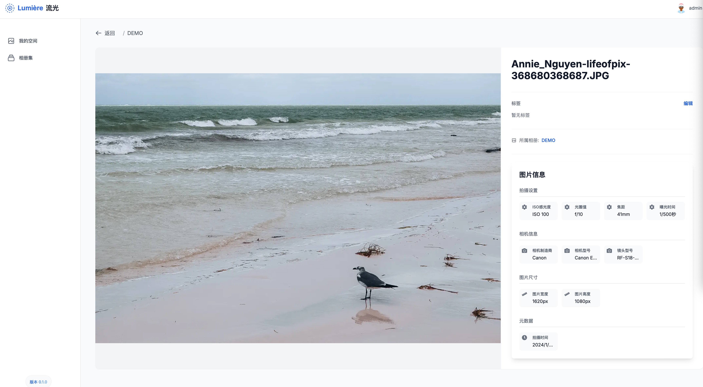
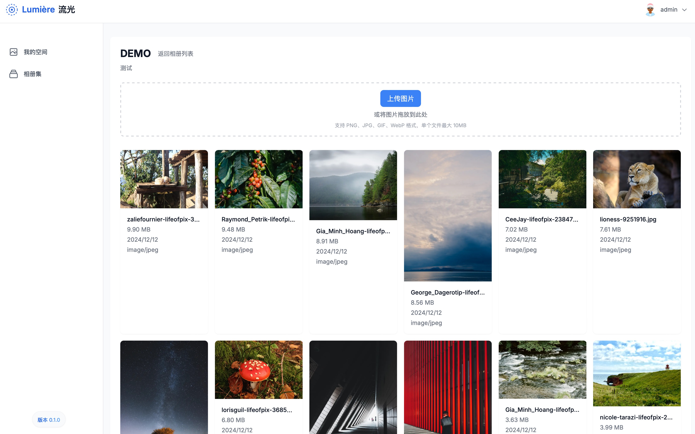
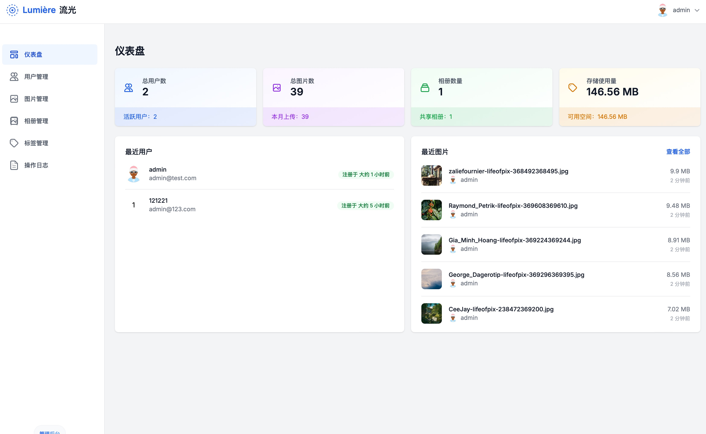
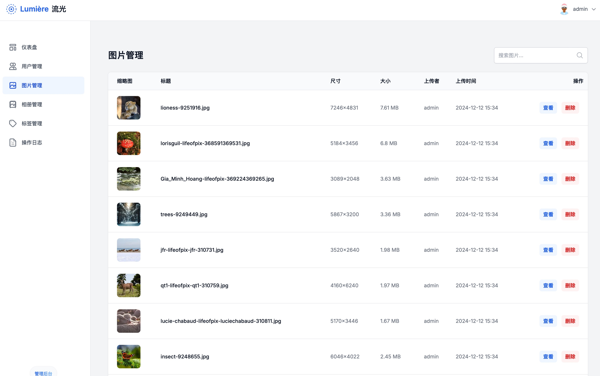
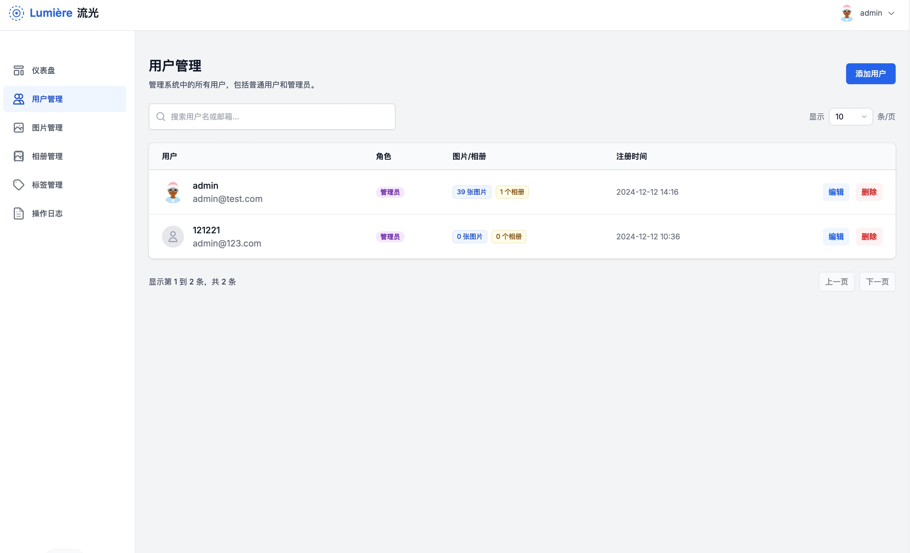

# Lumière (流光) - 优雅的图片管理系统


Lumière (流光) 是一个现代化的图片管理系统，专注于提供优雅的用户体验和强大的图片管理功能。项目名称 "流光" 寓意捕捉光影，珍存时光，完美契合其作为图片管理工具的核心理念。

(这个项目正在开发中，可能会有一些功能缺失或变更)

## ✨ 特性

- 🖼️ 智能相册管理
  - 支持创建和管理多个相册
  - 图片分类和组织
  - 优雅的网格视图布局

- 🔍 强大的图片信息展示
  - EXIF 数据读取和展示
  - 图片详细信息查看
  - 缩略图自动生成

- 🎨 现代化用户界面
  - 响应式设计
  - 深色模式支持
  - 流畅的动画效果

- 🔐 安全的用户认证
  - 基于 NextAuth.js 的认证系统
  - JWT 会话管理
  - 安全的密码加密存储

## 技术栈

- **前端框架**: Next.js 14+ (App Router)
- **样式**: Tailwind CSS
- **UI 组件**: Headless UI
- **状态管理**: React Hooks
- **数据库**: PostgreSQL
- **ORM**: Prisma
- **认证**: NextAuth.js
- **图片处理**: Sharp
- **文件存储**: 本地文件系统


## 📦 安装

1. 克隆仓库
```bash
git clone https://github.com/xiaoyaowx/lumpic.git
cd lumpic
```

2. 安装依赖
```bash
npm install
```

3. 环境配置
```bash
cp .env.example .env
```
编辑 .env 文件，配置必要的环境变量：
- DATABASE_URL
- NEXTAUTH_SECRET
- NEXTAUTH_URL

4. 数据库迁移
```bash
npx prisma migrate dev
```

5. 启动开发服务器
```bash
npm run dev
```

## 🌟 使用指南

1. 注册/登录账户
2. 创建相册
3. 上传图片到相册
4. 查看和管理图片
5. 享受流畅的图片管理体验

## 📸 项目截图

### 登录界面


### 首页


### 图片浏览


### 图片上传


### 管理界面


### 照片管理


### 用户管理


## 📝 开发计划

- [ ] 多语言支持
- [ ] 高级搜索功能
- [ ] 图片编辑功能
- [ ] 批量操作
- [ ] 分享功能
- [ ] 移动端优化

## 🤝 贡献

欢迎提交 Issue 和 Pull Request！

## 📄 许可证

[MIT License](LICENSE)

## 🙏 致谢

感谢所有为这个项目做出贡献的开发者！

## Image Upload System

一个基于 Next.js 14+ 开发的现代化图片上传和管理系统。


## 文件存储结构

图片文件按照日期自动分类存储：

```
public/
├── uploads/              # 原始图片
│   ├── 2024/
│   │   ├── 12/
│   │   │   └── 10/      # 按日期分类
│   │   │       └── [timestamp]-[random].[ext]
│   └── ...
└── thumbnails/          # 缩略图
    ├── 2024/
    │   ├── 12/
    │   │   └── 10/
    │   │       └── [timestamp]-[random].[ext]
    └── ...
```

## 环境要求

- Node.js 18+
- PostgreSQL 16+
- 足够的磁盘空间用于存储图片

## 感谢
codeium Windurf
https://codeium.com/windsurf 
